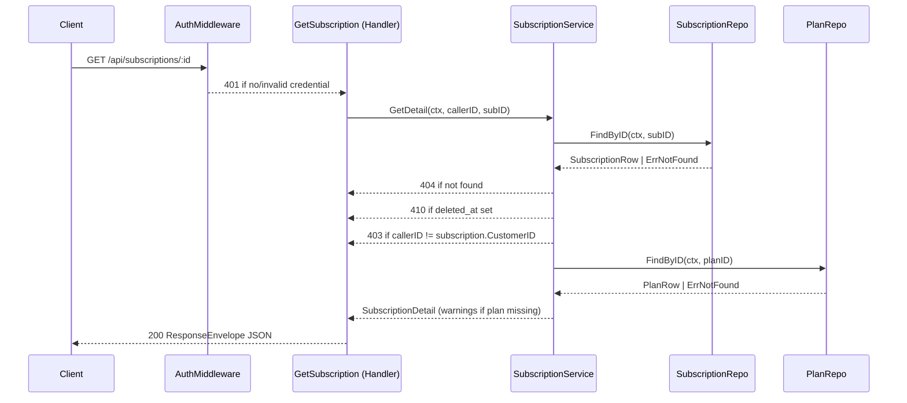

# Design Document: Subscription Detail Expansion

## Overview

This design enriches the `GET /api/subscriptions/:id` endpoint in the Stellarbill Go/Gin backend.
The current handler returns a minimal placeholder. After this change it will return a fully populated
`Response_Envelope` containing subscription fields, embedded `Plan_Metadata`, a normalized
`Billing_Summary`, a schema version marker, and correct HTTP semantics for missing, soft-deleted,
and unauthorized requests.

The work is organized into four layers:

1. **Repository** — data-access structs and lookup functions for subscriptions and plans.
2. **Service** — business logic: plan join, billing normalization, soft-delete check, auth enforcement.
3. **Handler** — HTTP glue: parameter validation, service calls, envelope assembly, header setting.
4. **Tests** — unit, integration, and property-based tests.

---

## Architecture



### Key Design Decisions

- **Repository layer is introduced** — the current handlers query nothing; a thin repository
  interface is added so the service and handler stay testable via mocks.
- **Service layer owns business logic** — keeps the handler thin and makes unit testing
  straightforward without spinning up HTTP.
- **Auth middleware vs. handler** — a reusable `AuthMiddleware` validates the JWT and injects
  `callerID` into the Gin context; the service performs the ownership check. This separates
  authentication (401) from authorization (403).
- **`amount` stored as string, normalized in service** — the existing `Subscription` struct stores
  `Amount` as a string. The service parses it to `int64` cents; a parse failure returns HTTP 500.

---

## Components and Interfaces

### Repository interfaces (`internal/repository/`)

```go
// SubscriptionRepository is the read interface used by the service.
type SubscriptionRepository interface {
    FindByID(ctx context.Context, id string) (*SubscriptionRow, error)
}

// PlanRepository is the read interface used by the service.
type PlanRepository interface {
    FindByID(ctx context.Context, id string) (*PlanRow, error)
}

// Sentinel errors
var ErrNotFound = errors.New("not found")
```

### Service (`internal/service/subscription_service.go`)

```go
type SubscriptionService interface {
    GetDetail(ctx context.Context, callerID string, subscriptionID string) (*SubscriptionDetail, error)
}
```

Error types returned by `GetDetail`:

| Error type        | HTTP mapping |
| ----------------- | ------------ |
| `ErrNotFound`     | 404          |
| `ErrDeleted`      | 410          |
| `ErrForbidden`    | 403          |
| `ErrBillingParse` | 500          |

### Auth Middleware (`internal/middleware/auth.go`)

```go
// AuthMiddleware validates the Authorization header (Bearer JWT).
// On success it sets "callerID" in the Gin context and calls c.Next().
// On failure it aborts with 401.
func AuthMiddleware(jwtSecret string) gin.HandlerFunc
```

### Handler (`internal/handlers/subscriptions.go`)

`GetSubscription` is updated to:

1. Read `callerID` from context (set by middleware).
2. Validate the `:id` path param (400 if empty/malformed).
3. Call `SubscriptionService.GetDetail`.
4. Map service errors to HTTP status codes.
5. Set `Content-Type: application/json; charset=utf-8`.
6. Wrap the result in a `ResponseEnvelope` and call `c.JSON(200, envelope)`.

---

## Data Models

### Repository row types (`internal/repository/models.go`)

```go
// SubscriptionRow is the raw DB record.
type SubscriptionRow struct {
    ID          string
    PlanID      string
    CustomerID  string   // used for ownership check; NOT exposed in response
    Status      string
    Amount      string   // e.g. "1999" (cents as string) or "19.99"
    Currency    string   // ISO 4217
    Interval    string
    NextBilling string   // RFC 3339 or empty
    DeletedAt   *time.Time
}

// PlanRow is the raw DB record for a billing plan.
type PlanRow struct {
    ID          string
    Name        string
    Amount      string
    Currency    string
    Interval    string
    Description string
}
```

### Service / response types (`internal/service/types.go`)

```go
// PlanMetadata is the plan subset embedded in the response.
type PlanMetadata struct {
    PlanID      string `json:"plan_id"`
    Name        string `json:"name"`
    Amount      string `json:"amount"`
    Currency    string `json:"currency"`
    Interval    string `json:"interval"`
    Description string `json:"description,omitempty"`
}

// BillingSummary holds normalized billing fields.
type BillingSummary struct {
    AmountCents    int64   `json:"amount_cents"`
    Currency       string  `json:"currency"`        // ISO 4217 uppercase
    NextBillingDate *string `json:"next_billing_date"` // RFC 3339 or null
}

// SubscriptionDetail is the payload placed in ResponseEnvelope.Data.
type SubscriptionDetail struct {
    ID             string          `json:"id"`
    PlanID         string          `json:"plan_id"`
    Customer       string          `json:"customer"`
    Status         string          `json:"status"`
    Interval       string          `json:"interval"`
    Plan           *PlanMetadata   `json:"plan,omitempty"`
    BillingSummary BillingSummary  `json:"billing_summary"`
}

// ResponseEnvelope is the top-level JSON object.
type ResponseEnvelope struct {
    APIVersion string              `json:"api_version"`
    Data       *SubscriptionDetail `json:"data,omitempty"`
    Warnings   []string            `json:"warnings,omitempty"`
}
```

`APIVersion` is always set to `"1"`.

### Sensitive field exclusion

`CustomerID` (internal DB foreign key) and any cost-basis fields are present only in
`SubscriptionRow` and are never copied into `SubscriptionDetail` or any exported type.

---

## Correctness Properties

_A property is a characteristic or behavior that should hold true across all valid executions of a system — essentially, a formal statement about what the system should do. Properties serve as the bridge between human-readable specifications and machine-verifiable correctness guarantees._

### Property 1: Successful response envelope invariants

_For any_ valid `SubscriptionRow` (non-deleted, parseable amount, caller owns it), calling `GetSubscription` SHALL return HTTP 200, a `Content-Type` header of `application/json; charset=utf-8`, and a `ResponseEnvelope` whose `api_version` field equals `"1"` and whose `data` field contains the subscription's `id`, `plan_id`, `customer`, `status`, and `interval`.

**Validates: Requirements 1.1, 4.1, 4.2**

### Property 2: Plan metadata embedded when plan exists

_For any_ valid subscription paired with an existing `PlanRow`, the `data.plan` object in the response SHALL be non-null and SHALL contain `plan_id`, `name`, `amount`, `currency`, `interval` values matching the `PlanRow`.

**Validates: Requirements 2.1**

### Property 3: Missing plan produces warning and no plan object

_For any_ valid subscription whose `plan_id` does not resolve to a `PlanRow`, the response `data.plan` field SHALL be absent (omitted/null) and the `warnings` array SHALL contain exactly the string `"plan not found"`.

**Validates: Requirements 2.2**

### Property 4: Billing summary normalization

_For any_ subscription with a parseable `amount` string, the `billing_summary` in the response SHALL have `amount_cents` as a non-negative integer, `currency` as a three-letter uppercase string, and `next_billing_date` as either a valid RFC 3339 string or `null` when `next_billing` is absent or empty (edge case: empty `next_billing` → `null`).

**Validates: Requirements 3.1, 3.3**

### Property 5: Unparseable amount yields HTTP 500

_For any_ subscription whose `amount` field is not parseable as a number of cents (e.g. `"abc"`, `""`), the handler SHALL return HTTP 500 with a JSON body containing an `error` field.

**Validates: Requirements 3.2**

### Property 6: Soft-deleted subscription yields HTTP 410

_For any_ `SubscriptionRow` where `deleted_at` is non-nil, the handler SHALL return HTTP 410 with a JSON body where `error` equals `"subscription has been deleted"`.

**Validates: Requirements 5.1**

### Property 7: Unknown subscription ID yields HTTP 404

_For any_ subscription ID string that does not correspond to a stored record, the handler SHALL return HTTP 404 with a JSON body containing an `error` field.

**Validates: Requirements 1.2**

### Property 8: Malformed subscription ID yields HTTP 400

_For any_ request where the `:id` path parameter is empty or structurally invalid (e.g. contains only whitespace), the handler SHALL return HTTP 400 with a JSON body containing an `error` field.

**Validates: Requirements 1.3**

### Property 9: Missing credential yields HTTP 401

_For any_ request to `GET /api/subscriptions/:id` that carries no `Authorization` header or an invalid/expired JWT, the handler SHALL return HTTP 401 with a JSON body containing an `error` field.

**Validates: Requirements 6.1**

### Property 10: Non-owner credential yields HTTP 403

_For any_ request where the JWT identifies a caller whose ID does not match the subscription's `CustomerID`, the handler SHALL return HTTP 403 with a JSON body containing an `error` field.

**Validates: Requirements 6.2**

### Property 11: No sensitive fields in response

_For any_ successful response, the serialized JSON SHALL NOT contain the keys `customer_id`, `cost_basis`, or any other internal field not listed in `SubscriptionDetail`.

**Validates: Requirements 6.3**

### Property 12: JSON round-trip fidelity

_For any_ `ResponseEnvelope` value produced by the handler, marshaling it to JSON and then unmarshaling back into a `ResponseEnvelope` SHALL produce a value that is deeply equal to the original.

**Validates: Requirements 7.6**

---

## Error Handling

| Scenario                                 | HTTP Status      | Response body                                                    |
| ---------------------------------------- | ---------------- | ---------------------------------------------------------------- |
| Missing / invalid `Authorization` header | 401              | `{"error": "<message>"}`                                         |
| Caller does not own subscription         | 403              | `{"error": "forbidden"}`                                         |
| `:id` empty or malformed                 | 400              | `{"error": "subscription id required"}`                          |
| Subscription not found                   | 404              | `{"error": "subscription not found"}`                            |
| Subscription soft-deleted                | 410              | `{"error": "subscription has been deleted"}`                     |
| `amount` parse failure                   | 500              | `{"error": "internal error"}` (parse failure logged)             |
| Plan not found (non-fatal)               | 200 + `warnings` | `{"api_version":"1","data":{...},"warnings":["plan not found"]}` |

All error responses set `Content-Type: application/json; charset=utf-8`.

The service logs parse failures at `ERROR` level with the raw `amount` value and subscription ID before returning `ErrBillingParse`. No stack traces or internal details are forwarded to the caller.

---

## Testing Strategy

### Dual testing approach

Both unit tests and property-based tests are required. Unit tests cover specific examples and integration wiring; property tests verify universal correctness across generated inputs.

### Unit tests (`internal/handlers/subscriptions_test.go`, `internal/service/subscription_service_test.go`)

Focus areas:

- Happy path: valid subscription + plan → full envelope (covers Req 7.1)
- Missing plan → warnings array, no `plan` field (covers Req 7.2)
- Soft-deleted → 410 (covers Req 7.3)
- Unknown ID → 404 (covers Req 7.4)
- Integration test: full HTTP round-trip via `httptest.NewRecorder` asserting envelope schema (covers Req 7.5)
- Auth middleware: 401 on missing header, 403 on wrong caller

Keep unit tests focused on concrete examples and integration points. Avoid duplicating coverage that property tests already provide.

### Property-based tests (`internal/handlers/subscriptions_prop_test.go`)

Use **[`pgregory.net/rapid`](https://github.com/pgregory/rapid)** — a pure-Go property-based testing library with shrinking support, no external dependencies.

Each property test runs a minimum of **100 iterations** (rapid default; increase via `rapid.Settings{Steps: 100}`).

Each test is tagged with a comment in the format:
`// Feature: subscription-detail-expansion, Property <N>: <property_text>`

| Property | Test description                                                                                                                                                            |
| -------- | --------------------------------------------------------------------------------------------------------------------------------------------------------------------------- |
| P1       | Generate random valid SubscriptionRow + PlanRow; assert 200, `api_version="1"`, `Content-Type` header, all required fields present                                          |
| P2       | Generate random SubscriptionRow + matching PlanRow; assert `data.plan` matches PlanRow fields                                                                               |
| P3       | Generate random SubscriptionRow with no matching plan; assert `data.plan` absent, `warnings` contains `"plan not found"`                                                    |
| P4       | Generate random SubscriptionRow with valid amount and random `next_billing` (including empty); assert `billing_summary` fields correct, `next_billing_date` null when empty |
| P5       | Generate random SubscriptionRow with non-numeric `amount`; assert 500                                                                                                       |
| P6       | Generate random SubscriptionRow with non-nil `deleted_at`; assert 410 and error message                                                                                     |
| P7       | Generate random IDs not in the mock store; assert 404                                                                                                                       |
| P8       | Generate empty/whitespace-only ID strings; assert 400                                                                                                                       |
| P9       | Generate requests with missing/malformed `Authorization` header; assert 401                                                                                                 |
| P10      | Generate random callerID ≠ subscription.CustomerID; assert 403                                                                                                              |
| P11      | Generate any valid response; assert JSON keys do not include `customer_id` or `cost_basis`                                                                                  |
| P12      | Generate any valid `ResponseEnvelope`; marshal → unmarshal → assert deep equality                                                                                           |

Each correctness property is implemented by exactly one property-based test.
